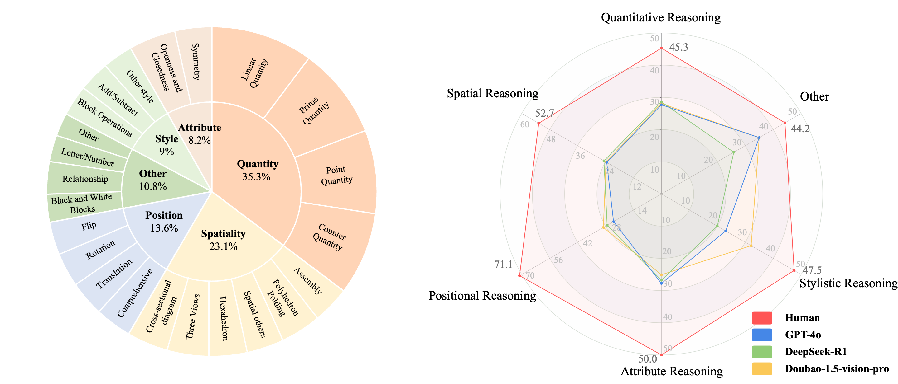
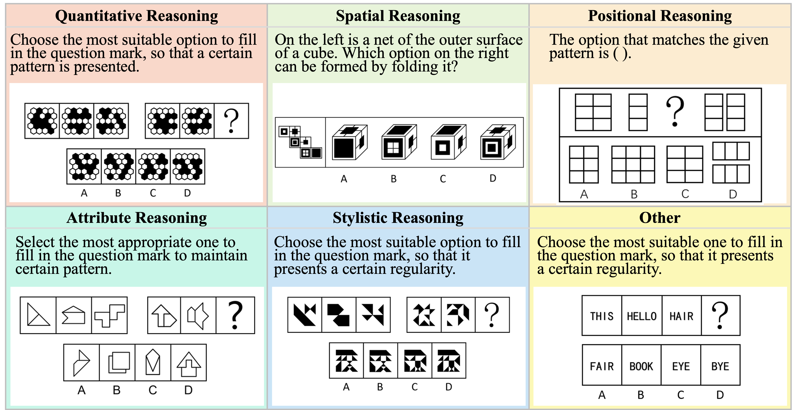
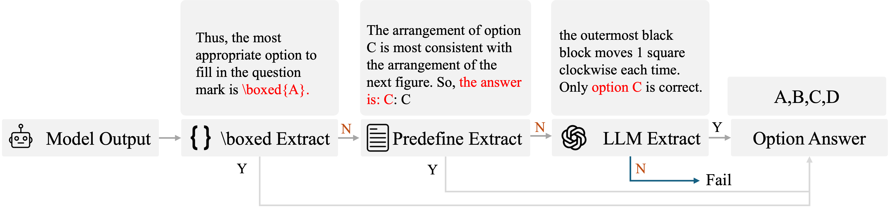

# VisuLogic: A Benchmark for Evaluating Visual Reasoning in Multi-modal Large Language Models

**A Challenging Visual-centric Benchmark for Evaluating Multimodal Reasoning in MLLMs!**

This is the Eval code repo of [VisuLogic](https://visulogic-benchmark.github.io/VisuLogic).

For more details, please refer to the project page for dataset exploration, code repos and visualization tools: [https://visulogic-benchmark.github.io/VisuLogic/](https://visulogic-benchmark.github.io/VisuLogic/).

# VisuLogic Resouces


[**🌐 Homepage**](https://visulogic-benchmark.github.io/VisuLogic) | [**🏆 Leaderboard**](https://visulogic-benchmark.github.io/VisuLogic/) | [**📖 Paper**](http://arxiv.org/abs/2504.15279) | [**🤗 Benchmark**](https://huggingface.co/datasets/VisuLogic/VisuLogic) | [**💻 Eval Code**](https://github.com/VisuLogic-Benchmark/VisuLogic-Eval) | [**🤗 Train Data**](https://huggingface.co/datasets/VisuLogic/VisuLogic-Train) | [**💻 Train Code**](https://github.com/VisuLogic-Benchmark/VisuLogic-Train)


## 🔔News
- **🔥[2025-06-28] Release the [SFT data](https://huggingface.co/datasets/VisuLogic/VisuLogic-Train)! 🚀**
- **🔥[2025-04-26] [VisuLogic](https://github.com/open-compass/VLMEvalKit/pull/944) has been merged into [VLMEvalkit](https://github.com/OpenCompass/VLMEvalkit). You can evaluate your model on VisuLogic with it ! Usage see [VLMEvalkit](https://github.com/open-compass/VLMEvalKit/blob/main/docs/en/Quickstart.md) ! 🚀** 
- **🔥[2025-04-22] Release the paper, training data and training code! 🚀**
- **🔥[2025-04-08] Release the benchmark and the code! 🚀**
## ✅ To-do
- [x] Release the benchmark dataset and eval code
- [x] Release training code
- [x] Release the paper
- [x] Release the training dataset
- [x] Release model ckpts


## 📖 Introduction
VisuLogic is a newly designed benchmark aimed at evaluating the visual reasoning capabilities of Multi-modal Large Language Models (MLLMs), independent of textual reasoning processes. It features carefully constructed visual reasoning tasks spanning multiple categories, divided into six types based on required reasoning skills (e.g., Quantitative Reasoning, which involves understanding and deducing changes in the quantity of elements in images). Unlike existing benchmarks, VisuLogic is a challenging visual reasoning benchmark that is inherently difficult to articulate using language, providing a more rigorous evaluation of the visual reasoning capabilities of MLLMs. Most models score below 30\% accuracy—only slightly above the 25\% random baseline and far below the 51.4\% achieved by humans—revealing significant gaps in visual reasoning.

## 🌟 Key Features

- 🚀 **Visuo-Logical Challenge**  
  The first benchmark to integrate **visual perception** with **logical reasoning**, enabling authentic multimodal evaluation. Most models score below **30%** accuracy—only slightly above the 25% random baseline and far below the 51.4% achieved by humans—revealing significant gaps in visual reasoning.
  
- 🛠️ **Rigorous Design**  
  Includes **1,000 meticulously curated questions**, spanning **6 domains** and **23 subcategories**, for comprehensive performance evaluation.
  
- 📝 **Anti-Linguistic Shortcut**  
  Designed to avoid linguistic reasoning, ensuring tasks rely on **genuine visual reasoning** rather than shortcuts.

- 💡 **RL Exploration**  
  We identify the  RL technique as a promising direction for improving the visual reasoning capabilities of MLLMs. Through RL method, models reach **SOTA** in VisuLogic!

- ✅ **Fully Open-source**  
  We **open-source** all the evaluation code, training scripts, and datasets associated with this work to promote further research and innovation.

## 🖼️  Examples of VisuLogic

## Installation & Preparation
### 🛠️ Default Installation
For InternVL series, QwenVL series, glm-4v, ovis2, mplug-om3, llava-onevision
```bash
pip install -r requirements.txt
```
### 🛠️ For Specific Models
#### minicpm-o Installation
```bash
pip install -r requirements.txt
pip install transformers==4.44.2
```
#### llava Installation
```bash
pip install -r requirements.txt
pip install transformers==4.37
```
#### sharegpt4v Installation
> For more details, please refer to this [link](https://huggingface.co/Lin-Chen/ShareGPT4V-7B).
```bash
pip install -r requirements.txt
pip install transformers==4.37
```

### 📂 Prepare Benchmark Data
1. Download huggingface dataset in https://huggingface.co/datasets/VisuLogic/VisuLogic
2. unzip images.zip
```
|- ...
|- data.jsonl
|- images/ (unzip from images.zip)
  |- 00000.png
  |- 00001.png
```


## 🚀 Evaluate Dedfault Models
For example, just find the corresponding model and execute its script.
```bash
sh scripts/eval_internvl.sh
```
## 🔧 Evaluate Your Own Model

VisuLogic provides a clean and extensible framework to evaluate custom models. You only need to add & change 2 files

### Steps to Add Your Model.
1. add `model/mymodel.py` with template as following:
```python
from models.base_model import BaseModel
class mymodel(BaseModel):
    def __init__(self, model_path: str, user_prompt: str = None):
      pass

    def predict(self, input_data: Any) -> Any:
      """
        Model prediction interface
        Args:
            input_data: 
              input_data['text'] # question text
              input_data['image_path'] # image path of question
      """
        pass
    
    @property
    def name(self) -> str:
        """Model name"""
        pass
```
2. modified `model/__init__.py`
```python
...
from models.mymodel import mymodel
def load_model(args):
  ...
  elif 'mymodel' in args.model_path.lower():
    model = mymodel(model_path = args.model_path,
                    user_prompt = args.user_prompt)
  ...
  return model
```
3. run scripts
```bash
mkdir -p outputs/
python evaluation/eval_model.py \
    --input_file path/to/data.jsonl \
    --output_file outputs/output_file.jsonl \
    --model_path mymodel \
    --judge_api_key sk-xxx
```

## 🛠️ Pipeline of Evaluation

VisuLogic evaluates model accuracy by combining boxed, predefined, and LLM-based extraction methods to produce a single choice (a/b/c/d), then compares it with the ground-truth label to determine correctness.

## 📦 Training

Please refer to [VisuLogic-Train](https://github.com/VisuLogic-Benchmark/VisuLogic-Train.git) for training code.

## 📩 Contact
- Weiye Xu: ustcxwy0271@mail.ustc.edu.cn
- Jiahao Wang: wjhwdscience@stu.xjtu.edu.cn

## 📜 Citation

**BibTeX:**
```bibtex
@article{xu2025visulogic,
  title={VisuLogic: A Benchmark for Evaluating Visual Reasoning in Multi-modal Large Language Models},
  author={Xu, Weiye and Wang, Jiahao and Wang, Weiyun and Chen, Zhe and Zhou, Wengang and Yang, Aijun and Lu, Lewei and Li, Houqiang and Wang, Xiaohua and Zhu, Xizhou and Wang, Wenhai and Dai, Jifeng and Zhu, Jinguo},
  journal={arXiv preprint arXiv:2504.15279},
  year={2025},
  url={https://arxiv.org/abs/2504.15279}
}
```
🎉 Thank you for your interest in VisuLogic! We hope this benchmark helps drive advancements in multimodal reasoning! 🚀
